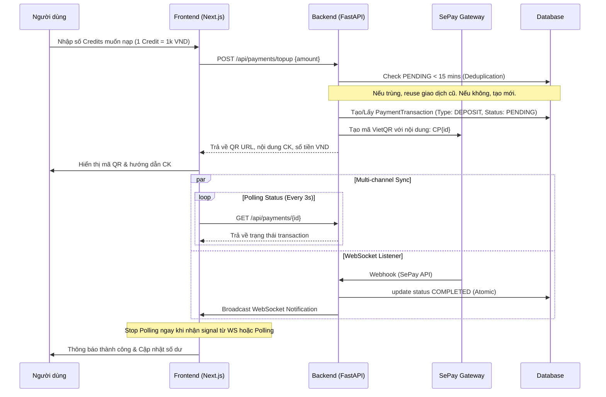
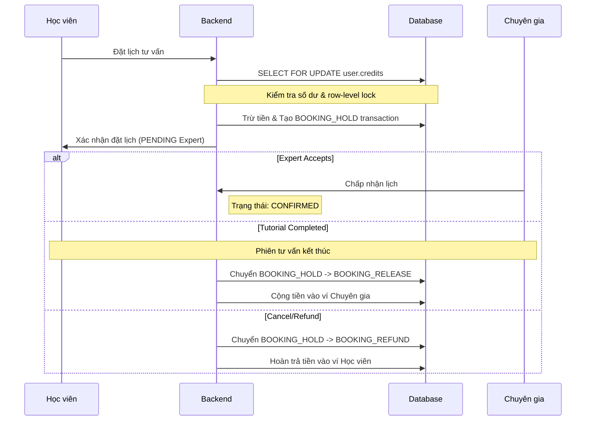
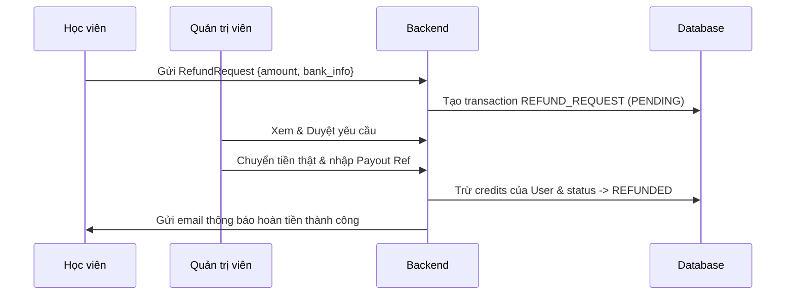

# Tổng hợp Luồng Payment trong VOCA

Tài liệu này tổng hợp toàn bộ quy trình thanh toán, quản lý số dư, lịch sử giao dịch và hệ thống thông báo liên quan đến tài chính trong hệ thống VOCA.

## 1. Quy trình Nạp tiền (Top-up Flow)

Hệ thống sử dụng **SePay (VietQR)** để hỗ trợ nạp tiền tự động 24/7.

## 2. Quy trình Ký gửi (Escrow Flow - Booking)

Đảm bảo an toàn thanh toán cho cả học viên và chuyên gia.

## 3. Quy trình Rút tiền (Expert Withdrawal)

Dành cho Chuyên gia để chuyển đổi Credits thành tiền mặt.

1. **Cập nhật KYC**: Chuyên gia điền thông tin ngân hàng trong hồ sơ.
2. **Tạo yêu cầu**: Expert gọi `POST /withdrawal-requests`.
3. **Tạm khóa (Atomic)**: 
   - Backend thực hiện `SELECT FOR UPDATE` trên bảng User.
   - Trừ ngay Credits khả dụng.
   - Tạo giao dịch `WITHDRAWAL` ở trạng thái `PENDING_PAYOUT`.
4. **Phê duyệt (Admin Audit)**:
   - Admin kiểm tra danh sách yêu cầu.
   - Khi `Approve`: Bắt buộc nhập `payout_reference` (mã giao dịch ngân hàng thực tế). status -> `COMPLETED`.
   - Khi `Reject`: Hoàn trả Credits vào ví Expert. status -> `REJECTED_PAYOUT`.
5. **Thông báo**: Gửi Email và thông báo Web cho Expert khi có kết quả.

## 4. Quy trình Hoàn tiền (Refund Request) - UC-36

Học viên yêu cầu rút tiền VND từ credits đã nạp về tài khoản ngân hàng.

## 5. Quản lý Số dư & Lịch sử Giao dịch

### Phân loại Trạng thái (Transaction Status)
- `PENDING`: Đang chờ hành động (thường là nạp tiền).
- `COMPLETED`: Thành công, tiền đã biến động.
- `FAILED`: Giao dịch bị lỗi.
- `PENDING_PAYOUT`: Đặc thù cho rút tiền, đang chờ Admin duyệt chuyển khoản.
- `REJECTED_PAYOUT`: Admin từ chối rút tiền, credits đã được trả lại.
- `REFUNDED`: Đặc thù cho Refund Request, tiền đã trả về ngân hàng.

### Cơ chế An toàn (Security)
- **Zero-Double-Spend**: Mọi luồng trừ tiền (Booking, Withdrawal) bắt buộc sử dụng `with_for_update` (Row-level locking) để tránh race condition.
- **Deduplication (BR-17.1)**: Tái sử dụng giao dịch nạp tiền cũ trong cửa sổ **15 phút** để tránh tràn dữ liệu.
- **Audit Trace**: Mọi giao dịch tiền ra (Withdrawal, Refund) đều bắt buộc ghi lại `payout_reference`.
- **Sync Protection**: FE sử dụng `processedTrxIds` để đảm bảo UI chỉ hiển thị thông báo thành công 1 lần duy nhất mặc dù nhận tín hiệu từ cả Polling và WebSocket.

## 6. Hệ thống Thông báo (Notifications)
- **WebSocket**: Cập nhật tức thời (trạng thái đặt lịch, nạp tiền, tin nhắn).
- **Email (Priority: HIGH)**: Gửi tự động khi nạp tiền thành công, rút tiền được duyệt/từ chối, hoăc có Refund thành công.
