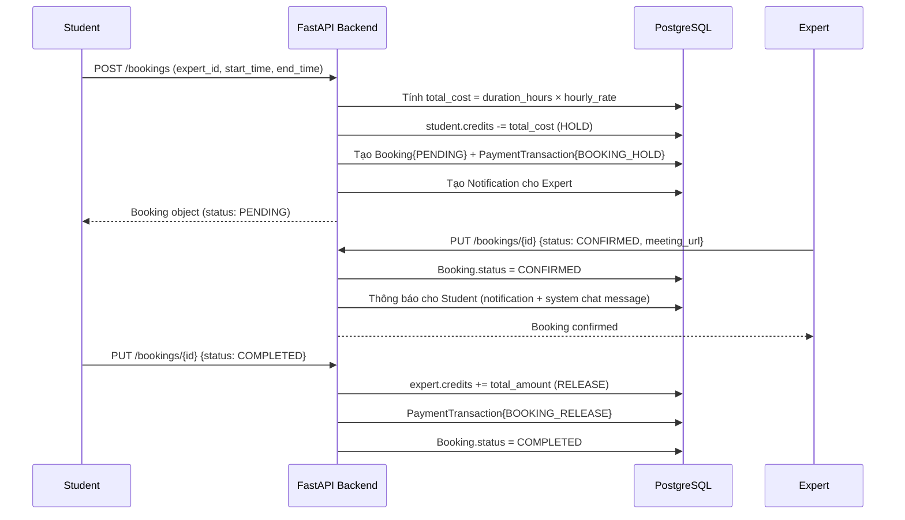

# 📋 Tài Liệu Ngữ Cảnh Dự Án (Project Context Document)

**Tên dự án:** VOCA — CareerPath & AI Optimizer  
**Ngày phân tích:** 2026-04-21  
**Người phân tích:** Senior Software Architect & Product Manager  
**Phiên bản hệ thống:** Backend v0.1, Frontend v0.1 (Next.js 16.1.6, React 19)

---

## 1. Tổng Quan Dự Án

### 1.1 Mục Tiêu Cốt Lõi

**VOCA** (tên thương mại) là một nền tảng EdTech **Decision Support System (DSS)** nhắm vào hai nhóm đối tượng chính của thị trường Việt Nam:

| Giai đoạn | Đối tượng | Vấn đề được giải quyết |
|---|---|---|
| **Định hướng nghề nghiệp** | Học sinh THPT (lớp 12) | Thiếu công cụ khoa học (Holland/MBTI/Ikigai) và kênh kết nối chuyên gia đáng tin cậy |
| **Gia nhập thị trường** | Sinh viên mới tốt nghiệp | Thiếu kỹ năng trình bày năng lực (CV) và cơ hội luyện phỏng vấn thực tiễn |

Platform hoạt động theo mô hình **Expert Marketplace + AI Assistant tích hợp**, không cạnh tranh với các trang tuyển dụng mà định vị như một **trợ lý quyết định**. Doanh thu đến từ hai luồng:

- **Commission-based:** Nền tảng giữ lại 20% phí khi chuyên gia hoàn thành buổi tư vấn (80% cho chuyên gia).
- **Freemium/Pay-per-use:** Chấm điểm CV miễn phí, phỏng vấn AI tính phí theo phiên.

---

## 2. Kiến Trúc Phần Mềm Hiện Tại

### 2.1 Tổng Quan Kiến Trúc Hệ Thống

```
┌──────────────────────────────────────────────────────────────────────┐
│                          CLIENT LAYER                                │
│              Next.js 16 (React 19) — Port 3000                       │
│  ┌─────────┐ ┌─────────┐ ┌─────────┐ ┌──────────┐ ┌─────────────┐  │
│  │ Zustand │ │ Axios   │ │WebSocket│ │TailwindCSS│ │ Framer Mot.│  │
│  │ Store   │ │ API Svc │ │ Client  │ │ (v4)     │ │ Animations │  │
│  └─────────┘ └─────────┘ └─────────┘ └──────────┘ └─────────────┘  │
└───────────────────────────────┬──────────────────────────────────────┘
                                │ HTTP/REST (JWT Bearer)
                                │ WebSocket (ws://)
┌───────────────────────────────▼──────────────────────────────────────┐
│                          API LAYER                                   │
│              FastAPI 0.128 (Uvicorn + Asyncio) — Port 8000           │
│  ┌─────────────────────────────────────────────────────────────┐     │
│  │                 /api/v1/                                    │     │
│  │  auth │ users │ experts │ bookings │ payments │ chat        │     │
│  │  ai   │ admin │ moderat.│ roadmap  │ assessm. │ reviews     │     │
│  │  notifications │ account_actions │ conversations             │     │
│  └─────────────────────────────────────────────────────────────┘     │
│  ┌─────────────────────────────────────────────────────────────┐     │
│  │              StaticFiles /uploads (local disk)              │     │
│  └─────────────────────────────────────────────────────────────┘     │
└───────────────────────────────┬──────────────────────────────────────┘
                                │ SQLAlchemy 2.0 (async)
┌───────────────────────────────▼──────────────────────────────────────┐
│                          DATA LAYER                                  │
│  PostgreSQL + Alembic Migrations                                     │
│  Tables: user, expert_profiles, expert_availabilities, bookings,     │
│          transactions, messages, reviews, notifications,             │
│          roadmaps, assessment_questions, user_assessment_results,    │
│          cv_analyses, mock_interviews, blacklist, account_actions,   │
│          email_logs                                                  │
└──────────────────────────────────────────────────────────────────────┘
```

### 2.2 Các Module Backend Chính

| Module | File Endpoint | Chức năng chính |
|---|---|---|
| **Auth** | `auth.py` | Đăng nhập (email/pass), đăng ký, Google OAuth (mock), reset password |
| **Users** | `users.py` | CRUD profile người dùng, upload avatar |
| **Experts** | `experts.py` | Quản lý ExpertProfile, KYC submission, quản lý lịch trống, cập nhật bank info |
| **Bookings** | `bookings.py` | Tạo booking (escrow hold), confirm/cancel/complete, check-in (UC-37), no-show resolution |
| **Payments** | `payments.py` | Top-up (SePay/VietQR webhook), lịch sử giao dịch, refund request (UC-36), expert withdrawal (UC-19) |
| **Chat** | `chat.py` | REST gửi tin nhắn, lịch sử chat, WebSocket real-time, content filter (BR-29) |
| **AI** | `ai.py` | CV analysis (mock), mock interview simulate/submit |
| **Assessments** | `assessments.py` | Tạo/làm bài đánh giá Holland/MBTI/Ikigai |
| **Reviews** | `reviews.py` | Học viên đánh giá chuyên gia sau booking |
| **Roadmap** | `roadmap.py` | AI tạo và quản lý lộ trình học tập |
| **Admin** | `admin.py` | Stats dashboard, CRUD users, quản lý KYC chuyên gia |
| **Moderation** | `moderation.py` | Xử lý tranh chấp, force refund/release |
| **Notifications** | `notifications.py` | Hệ thống thông báo (DB + WebSocket push) |
| **Account Actions** | `account_actions.py` | Suspend/ban/unban user, ghi nhật ký các hành động admin |
| **Blacklist** | *(qua register)* | Chặn email/số điện thoại đăng ký lại sau khi bị ban |

### 2.3 Luồng Dữ Liệu (Data Flows)

#### 🔐 Luồng Xác Thực (Auth Flow)

```
Client → POST /api/v1/auth/login/access-token
       → Backend: Verify email/pass + check account_status (ACTIVE/SUSPENDED/BANNED)
       → Return JWT (HS256, expiry từ config)
       → Client lưu token vào Zustand store (persist vào localStorage key 'auth-storage')
       → Mọi request tiếp theo gửi Header: Authorization: Bearer <token>
       → Backend deps.py verify JWT → lấy user từ DB
```

#### 💳 Luồng Đặt Lịch & Thanh Toán (Booking Escrow Flow)



#### 💰 Luồng Nạp Tiền (SePay Webhook Flow)

```
Student → POST /payments/topup {amount: X}
        → Backend tạo PaymentTransaction{PENDING}, generates QR URL (VietQR)
        → Student quét QR, chuyển tiền tới SePay bank account
        → SePay → POST /payments/webhook/sepay {content: "CP{transaction_id}", transferAmount}
        → Backend verify accountNumber match, parse "CP{id}"
        → user.credits += amount, Transaction{COMPLETED}
        → Thông báo realtime cho user
```

> [!WARNING]
> Webhook chỉ verify `accountNumber` (không có HMAC signature). Đây là security gap nghiêm trọng.

#### 💬 Luồng Chat Real-time

```
Client → WebSocket connect: ws://localhost:8000/api/v1/chat/ws?token=<JWT>
       → Backend: auth from token, manager.connect(user_id, ws)

Gửi tin: Client → POST /chat/ {receiver_id, content}
       → validate_content (BR-29: block phone/email/keywords)
       → Lưu Message vào DB
       → manager.send_personal_message() → cả sender và receiver
       → create_notification cho receiver

Typing indicator: Client → WebSocket send {type: "typing", receiver_id, is_typing}
              → Backend relay → manager.send_personal_message(receiver_id)
```

---

## 3. Tech Stack & Môi Trường

### 3.1 Backend

| Thành phần | Công nghệ | Phiên bản |
|---|---|---|
| **Runtime** | Python | 3.12+ |
| **Web Framework** | FastAPI | 0.128.0 |
| **ASGI Server** | Uvicorn + uvloop | 0.40.0 + 0.22.1 |
| **ORM** | SQLAlchemy (async) | 2.0.46 |
| **DB Driver** | asyncpg (async), psycopg2-binary | 0.31.0 |
| **Migration** | Alembic | 1.18.3 |
| **Auth** | python-jose (JWT, HS256), passlib (bcrypt) | 3.5.0 |
| **Validation** | Pydantic v2 | 2.12.5 |
| **Email** | `emails` library + premailer | 0.6 |
| **Payment Gateway** | SePay + VietQR (webhook-based) | Custom |
| **Real-time** | WebSocket (websockets 16.0) | Native FastAPI |
| **Compression** | GzipMiddleware | Built-in |
| **Database** | PostgreSQL | — |

### 3.2 Frontend

| Thành phần | Công nghệ | Phiên bản |
|---|---|---|
| **Meta-framework** | Next.js | 16.1.6 |
| **UI Library** | React | 19.2.3 |
| **Language** | TypeScript | 5.x |
| **HTTP Client** | Axios | 1.13.4 |
| **State Management** | Zustand (+ persist middleware) | 5.0.11 |
| **Styling** | TailwindCSS v4 + custom CSS variables | 4.x |
| **Animation** | Framer Motion | 12.35.1 |
| **Icons** | Lucide React | 0.575.0 |
| **Typography** | DM Sans + Cormorant Garamond (Google Fonts) | — |
| **Date Utils** | date-fns | 4.1.0 |
| **E2E Testing** | Playwright | 1.58.1 |

### 3.3 Môi Trường Phát Triển

- **OS:** Linux (WSL2 trên Windows, chạy trong `/home/hat_n/projects/`)
- **Backend chạy tại:** `http://localhost:8000`
- **Frontend chạy tại:** `http://localhost:3000`
- **API Docs:** `http://localhost:8000/docs` (Swagger UI)
- **Static Files:** Backend serve trực tiếp từ `backend/uploads/` (mounted tại `/uploads`)
- **DB:** PostgreSQL (local instance, không có Docker Compose riêng — có `docker-compose.yml` nhưng không phải thiết lập chính)
- **AI Engine:** Hiện tại 100% là **mock** (random score, hardcoded feedback) — chưa tích hợp OpenAI/LangChain thực sự

### 3.4 Mô Hình Dữ Liệu Chính (ERD Tóm Lược)

```
User (1) ──── (0..1) ExpertProfile (1) ──── (*) ExpertAvailability
 │                        │
 │                        └──── (*) Booking ──── (0..1) Review
 │                                   │
 │                                   └──── (*) PaymentTransaction
 │
 (*)───── Message (sender / receiver)
 (*)───── Notification (recipient / sender)
 (*)───── UserAssessmentResult ──── (*) AssessmentQuestion
 (*)───── CVAnalysis
 (*)───── MockInterview
 (*)───── AccountAction
 (*)───── Blacklist
```

**Mapping tài chính đặc biệt:**
- `PaymentTransaction.type` gồm 7 loại: `DEPOSIT`, `WITHDRAWAL`, `BOOKING_HOLD`, `BOOKING_RELEASE`, `BOOKING_REFUND`, `SERVICE_PAYMENT`, `REFUND_REQUEST`
- Số dư user được tính trực tiếp từ `User.credits` (không derived từ transactions)

---

## 4. Trải Nghiệm Người Dùng (UI/UX)

### 4.1 Cấu Trúc Route Frontend

```
/                             → Landing page (VOCA Home — hero, expert listings, features)
/(auth)/
  login/                      → Trang đăng nhập
  register/                   → Trang đăng ký (chọn vai: STUDENT / EXPERT)
/expert/[id]/                 → Trang chi tiết chuyên gia + đặt lịch
/pricing/                     → Trang giá dịch vụ
/banned/                      → Trang hiển thị khi tài khoản bị ban
/suspended/                   → Trang hiển thị khi tài khoản bị tạm khóa
/ai-tools/                    → AI Tools hub

/dashboard/                   → Dashboard chính (phân nhánh theo role)
  page.tsx                    → Redirect theo role
  student/                    → Dashboard học viên
  expert/                     → Dashboard chuyên gia
  admin/                      → Dashboard admin
  profile/                    → Trang chỉnh sửa hồ sơ
  chat/                       → Giao diện chat real-time
  wallet/                     → Ví học viên (nạp tiền, lịch sử giao dịch)
  roadmap/                    → Lộ trình học tập AI
  assessment/                 → Làm bài đánh giá (Holland/MBTI/Ikigai)
  result/                     → Kết quả đánh giá
  experts/                    → Danh sách và tìm kiếm chuyên gia
  manage/bookings/            → Quản lý lịch hẹn
  admin/
    users/                    → Quản lý người dùng (CRUD)
    experts/                  → Quản lý KYC chuyên gia
    bookings/                 → Quản lý tất cả booking
    payments/                 → Quản lý giao dịch và rút tiền
    moderation/               → Xử lý tranh chấp
    notifications/            → Gửi thông báo hệ thống
```

### 4.2 Design System — "Luxury Dark Mode" & "Cyber Matrix"

Dự án có **hai theme UI** song song, chuyển đổi bởi `ThemeToggle`:

- **Luxury Dark Mode (Default):** Màu sắc Obsidian, Navy, Gold, Ivory — font Cormorant Garamond + DM Sans. Aesthetic sang trọng, premium banking.
- **Cyber Matrix Theme:** Neon Magenta (#FF007F), Cyan (#00F0FF) — holographic grid background, glitch animations, cyberpunk aesthetic.

CSS variables được quản lý trong `globals.css`. Hệ thống chưa có Component Library riêng của Radix/shadcn.

### 4.3 Luồng Thao Tác Người Dùng (User Flow)

#### Luồng Học Viên (Student Journey)
```
Đăng ký/Đăng nhập
→ Làm bài Assessment (Holland/MBTI)
→ Xem kết quả + gợi ý chuyên gia
→ Duyệt danh sách chuyên gia (filter: tag, giá, rating)
→ Xem trang chuyên gia → Chọn slot thời gian
→ Xác nhận đặt lịch (trừ Credits — escrow)
→ Chat với chuyên gia → Nhận Meeting URL
→ Check-in vào phiên [T-5min ~ T+10min]
→ Tham gia tư vấn (Google Meet/Zoom)
→ Xác nhận hoàn thành → Đánh giá chuyên gia (1-5 sao)
```

#### Luồng Chuyên Gia (Expert Journey)
```
Đăng ký (role: EXPERT) → ExpertProfile tự động tạo
→ Điền thông tin KYC (bio, LinkedIn, kinh nghiệm, giá/giờ)
→ Chờ Admin duyệt
→ Thiết lập lịch trống (availability theo ngày/giờ)
→ Nhận thông báo booking mới → Confirm/Reject
→ Cung cấp Meeting URL qua chat → Thực hiện tư vấn
→ Check-in → Thực hiện phiên IN_PROGRESS
→ Nhận Credits sau khi học viên xác nhận hoàn thành
→ Rút tiền (Credits → Ngân hàng, qua Admin)
```

#### Luồng Admin
```
Login (is_superuser=true)
→ Dashboard: Stats (tổng users, bookings, experts)
→ Duyệt KYC chuyên gia (PENDING → APPROVED/REJECTED)
→ Quản lý User (CRUD, suspend/ban/unban)
→ Xử lý Dispute (force refund/release credits)
→ Duyệt Withdrawal requests (chuyển tiền tay)
→ Duyệt Refund requests (hoàn tiền học viên)
```

---

## 5. Vấn Đề Tồn Đọng & Nút Thắt Kỹ Thuật

> [!NOTE]
> Phần này chỉ **phân tích và ghi nhận hiện trạng** khách quan. Không đề xuất giải pháp.

### 5.1 Bảo Mật (Security)

| # | Vấn đề | Mức độ | Vị trí |
|---|---|---|---|
| **SEC-01** | **Webhook SePay không có HMAC verification.** Chỉ kiểm tra `accountNumber`. Bất kỳ ai biết số tài khoản ngân hàng đều có thể giả mạo webhook và cộng Credits tùy ý. | 🔴 CRITICAL | `payment_gateway.py:verify_webhook_data` |
| **SEC-02** | **Google OAuth là mock hoàn toàn.** Token bắt đầu bằng `mock_google_` được chấp nhận vô điều kiện. Không có bước verify real Google Service Account nào. | 🔴 CRITICAL | `auth.py:google_login` |
| **SEC-03** | **JWT không có Blacklist/Revocation.** Khi logout, token vẫn hợp lệ cho đến khi hết hạn `ACCESS_TOKEN_EXPIRE_MINUTES`. Nếu token bị lộ, không thể vô hiệu hóa ngay. | 🟡 HIGH | `useAuthStore.ts:logout`, `deps.py` |
| **SEC-04** | **Admin authorization inconsistent.** Một số endpoint dùng `Depends(deps.get_current_superuser)`, một số khác tự check `if not current_user.is_superuser`. Thiếu decorator chuẩn hóa gây nguy cơ bỏ sót. | 🟡 HIGH | `admin.py`, `payments.py` |
| **SEC-05** | **Content Filter (BR-29) dễ bypass.** Phone regex `\b(\d{3}[-.\s]?\d{3}[-.\s]?\d{4}|\d{10})\b` không bắt số điện thoại Việt Nam dạng `0912.345.678` hay `+84 912 345 678`. | 🟠 MEDIUM | `chat.py:validate_content` |
| **SEC-06** | **CORS quá rộng trong production-like config.** Cấu hình chỉ whitelist localhost nhưng sử dụng `allow_methods=["*"]`, `allow_headers=["*"]`. | 🟡 LOW | `app/main.py` |

### 5.2 Toàn Vẹn Dữ Liệu & Business Logic

| # | Vấn đề | Mức độ | Vị trí |
|---|---|---|---|
| **BL-01** | **Không có double-spend protection khi tạo booking (race condition).** Nếu học viên gửi 2 requests booking cùng lúc với đủ credits cho 1 booking, cả 2 có thể pass kiểm tra `if current_user.credits < total_cost` trước khi commit. | 🔴 HIGH | `bookings.py:create_booking` |
| **BL-02** | **`User.credits` là trường scalar được mutate trực tiếp**, không phải derived từ transaction history. Điều này có nghĩa là nếu có lỗi (crash giữa chừng, inconsistent commit), số dư sẽ không thể đối chiếu lại từ transaction log. | 🔴 HIGH | `models/user.py`, `bookings.py`, `payments.py` |
| **BL-03** | **Commission (20%) chưa được cài đặt.** Trong `bookings.py:COMPLETED`, 100% `total_amount` được release cho expert. Requirement plan nói rõ platform giữ 20%, expert nhận 80% — nhưng code không thực hiện điều này. | 🔴 HIGH | `bookings.py:update_booking_status` |
| **BL-04** | **No-show resolution (UC-37) phải được gọi thủ công.** Không có background scheduler (Celery, APScheduler) để tự động trigger sau T+10min. Frontend phải call `POST /bookings/{id}/resolve-noshow`. Nếu không ai gọi endpoint đó, booking bị kẹt ở CONFIRMED mãi mãi. | 🟡 HIGH | `bookings.py:resolve_noshow` |
| **BL-05** | **Quy trình "auto-finish sau 24h" từ requirement chưa cài đặt.** Không có mechanism tự động chuyển booking từ COMPLETED sang payout sau 24h. | 🟡 HIGH | Không có file tương ứng |
| **BL-06** | **Expert có thể reject booking CONFIRMED.** Status transition cho phép `CONFIRMED → CANCELLED/REJECTED`, dẫn đến expert có thể hủy sau khi đã xác nhận — gây UX xấu và credit refund sau khi student đã chuẩn bị. | 🟠 MEDIUM | `bookings.py:update_booking_status` |
| **BL-07** | **`Expert search` cũng trả về PENDING KYC experts.** `base_filters` trong `search_experts` include cả `KYCStatus.PENDING` lẫn `KYCStatus.APPROVED`. Học viên có thể thấy và đặt lịch với chuyên gia chưa được duyệt. | 🟠 MEDIUM | `experts.py:search_experts` |
| **BL-08** | **Rating expert được tính thủ công (không tự động).** Field `ExpertProfile.rating` và `total_reviews` không được update tự động khi tạo Review. Logic update rating phải được xử lý ở endpoint review, nhưng cần kiểm tra xem có xảy ra không. | 🟠 MEDIUM | `reviews.py` |

### 5.3 Kiến Trúc & Technical Debt

| # | Vấn đề | Mức độ | Vị trí |
|---|---|---|---|
| **ARCH-01** | **AI Module là 100% Mock.** CV analysis trả về `random.randint(60, 95)` và hardcoded feedback. Mock Interview cũng hardcoded. Tính năng cốt lõi (FE-04, FE-05) chưa kết nối với bất kỳ AI API thực nào. `/backend/app/ai_core/` chỉ có thư mục rỗng. | 🔴 CRITICAL | `ai.py`, `ai_core/` |
| **ARCH-02** | **Không có AI Cloud Integration (OpenAI/LangChain).** `requirements.txt` hoàn toàn không có `openai`, `langchain`, hay bất kỳ AI SDK nào. Cấu trúc thư mục `ai_core/chains/` và `ai_core/prompts/` tồn tại nhưng trống. | 🔴 CRITICAL | `requirements.txt` |
| **ARCH-03** | **Tên thương mại bất nhất.** Codebase dùng "CareerPath AI", README dùng "CareerPath AI", layout.tsx dùng "VOCA". Không có sự thống nhất về tên sản phẩm trong toàn bộ codebase. | 🟠 LOW | `README.md`, `layout.tsx` |
| **ARCH-04** | **Không có Request Rate Limiting.** Không có giới hạn số request cho các endpoint nhạy cảm như `/auth/login` (brute-force), `/payments/topup`, hay `/ai/cv-analyze`. | 🟡 HIGH | `app/main.py` |
| **ARCH-05** | **File upload không có cloud storage.** Avatar và CV được lưu tại `backend/uploads/` (thư mục cục bộ). Không tích hợp S3/Cloudinary. `ai.py:analyze_cv` thậm chí không thực sự lưu file mà dùng `fake_url`. | 🟡 HIGH | `ai.py`, `users.py` |
| **ARCH-06** | **Không có background task / task queue.** Hệ thống thiếu một queue (Celery/RQ) để xử lý các tác vụ bất đồng bộ như: gửi email thực, gọi AI API, resolve no-show tự động, auto-complete booking sau 24h. | 🟡 HIGH | Toàn hệ thống |
| **ARCH-07** | **WebSocket management không scale.** `chat_socket.py` dùng in-memory dict `{user_id: WebSocket}`. Nếu chạy nhiều process/instance (horizontal scale), user A kết nối tới instance 1 sẽ không nhận được tin từ user B kết nối tới instance 2. | 🟡 MEDIUM | `services/chat_socket.py` |
| **ARCH-08** | **Review model thiếu `unique` constraint trên `(booking_id, student_id)` thực sự được enforce.** Có `unique=True` trên `booking_id`, nhưng schema và validation logic cần kiểm tra thêm xem có thể tạo duplicate review không. | 🟠 MEDIUM | `models/review.py` |
| **ARCH-09** | **`ExpertAvailability` lưu theo "template tuần" (day_of_week, HH:MM), không phải actual time slots.** Hệ thống không check conflict khi nhiều booking trong cùng slot. Không có logic "slot đã bị book thì không cho book nữa". | 🟡 HIGH | `models/expert.py`, `bookings.py` |
| **ARCH-10** | **Admin revenue là placeholder cứng.** `GET /admin/stats` trả về `total_revenue: 0` (được comment out và hardcode). Admin không có dashboard doanh thu thực sự. | 🟠 MEDIUM | `admin.py:get_admin_stats` |
| **ARCH-11** | **`User` model thiếu `created_at`.** Admin sort by `created_at` nhưng `User` model không có field này. Code đã phải comment lại và dùng `User.id` làm proxy, với note trong code. | 🟠 MEDIUM | `models/user.py`, `admin.py` |
| **ARCH-12** | **Hai `venv` tồn tại song song.** Có `/venv` ở root và `/backend/venv`. Gây nhầm lẫn khi setup môi trường. | 🟠 LOW | Root directory |

### 5.4 Frontend / UX Issues

| # | Vấn đề | Mức độ | Vị trí |
|---|---|---|---|
| **FE-01** | **Zustand store chỉ lưu token dạng string trong localStorage** (persist). Không có cơ chế refresh token. Token hết hạn thì user bị logout đột ngột mà không có thông báo rõ ràng. | 🟡 HIGH | `useAuthStore.ts` |
| **FE-02** | **Hai theme không hoàn toàn tách biệt.** Nhiều component còn hardcode màu Tailwind defaults (blue, green, red) thay vì dùng CSS variable. Theme Cyber và Luxury chưa áp dụng nhất quán. | 🟠 MEDIUM | Nhiều component |
| **FE-03** | **Không có global error boundary / toast system chuẩn.** Xử lý lỗi API sẽ bị lọt nếu component không tự catch. | 🟠 MEDIUM | Toàn frontend |
| **FE-04** | **Frontend dùng Next.js 16 + React 19 là phiên bản rất mới** (cutting-edge), có thể có breaking changes chưa ổn định trong ecosystem. | 🟠 LOW | `package.json` |
| **FE-05** | **Avatar URL có thể là đường dẫn tương đối `/uploads/...`** được backend serve, nhưng nếu backend dùng HTTPS/CDN sau này, logic avatar sẽ bị sai. | 🟠 MEDIUM | `users.py`, frontend components |

---

## 6. Tóm Tắt Ma Trận Rủi Ro

```
                    CẦN XỬ LÝ NGAY        CẦN LÊN KẾ HOẠCH
                 ┌────────────────────┬────────────────────────┐
 MỨC ĐỘ CAO     │ SEC-01 (Webhook)   │ BL-04 (No-show auto)   │
                 │ SEC-02 (Google)    │ BL-05 (Auto-complete)  │
                 │ BL-03 (Commission) │ ARCH-06 (Task queue)   │
                 │ BL-01 (Race cond.) │ ARCH-07 (WS scale)     │
                 │ ARCH-01/02 (AI)    │ ARCH-09 (Slot conflict)│
                 ├────────────────────┼────────────────────────┤
 MỨC ĐỘ TRUNG   │ SEC-03 (JWT revok) │ BL-07 (PENDING search) │
                 │ ARCH-05 (File Svc) │ FE-01 (Token refresh)  │
                 │ BL-02 (Credits)    │ FE-02/03 (UX)          │
                 └────────────────────┴────────────────────────┘
                      TÁC ĐỘNG CAO            TÁC ĐỘNG TRUNG
```

---

*Tài liệu này là snapshot phân tích tại thời điểm 2026-04-21. Các con số version và file paths đều dựa trên source code thực tế đã đọc.*
