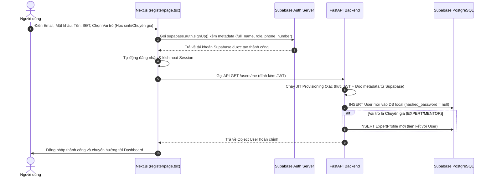
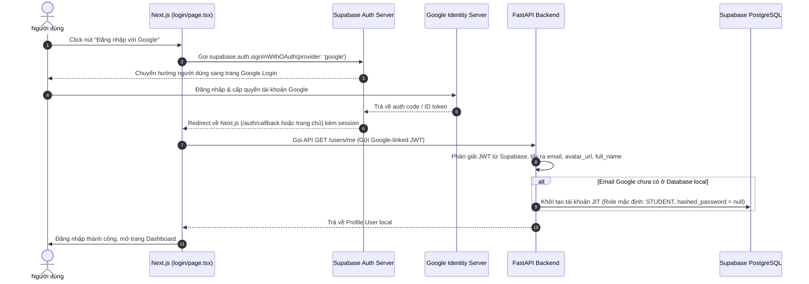
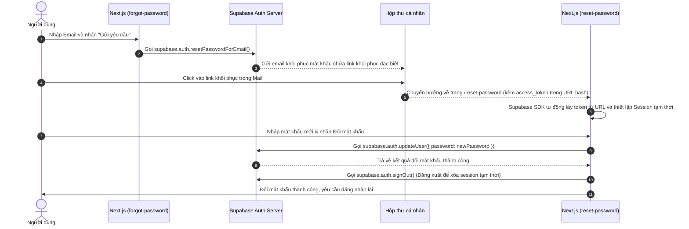

# Luồng Nghiệp vụ Supabase Authentication (VOCA Project)

Tài liệu này chi tiết hóa cách thức hoạt động, luồng code và sơ đồ tuần tự cho ba tính năng xác thực quan trọng nhất: **Đăng ký tài khoản**, **Đăng nhập bằng tài khoản Google (OAuth)**, và **Quên/Đặt lại mật khẩu**.

---

## 1. Luồng Đăng Kỳ Tài Khoản Mới (User Registration)

Khi người dùng tạo tài khoản mới bằng Email & Mật khẩu trên giao diện.

### 1.1 Sơ đồ Hoạt động


### 1.2 Chi tiết luồng Code
* **Frontend**: Tại file [register/page.tsx](file:///wsl.localhost/Ubuntu/home/hat_n/projects/CareerPath_AI_Project/frontend/src/app/(auth)/register/page.tsx), hệ thống sử dụng thư viện `@supabase/supabase-js` để gửi yêu cầu đăng ký kèm thông tin vai trò và tên hiển thị trong `options.data`:
  ```typescript
  const { data, error: signUpError } = await supabase.auth.signUp({
      email,
      password,
      options: {
          data: {
              full_name: fullName,
              role: role, // STUDENT, EXPERT, MENTOR
              phone_number: phoneNumber,
          }
      }
  });
  ```
* **Backend**: Khi gọi tới endpoint `/users/me` lần đầu, token JWT chứa `user_metadata` của Supabase được phân giải bởi `deps.py`. Hàm `get_or_create_user_from_payload` tự động insert user vào database local và khởi tạo `ExpertProfile` nếu role của user là `EXPERT` hoặc `MENTOR`.

---

## 2. Luồng Đăng Nhập Bằng Google (Google OAuth Sign-In)

Cho phép người dùng đăng nhập nhanh bằng tài khoản Google thông qua Supabase.

### 2.1 Sơ đồ Hoạt động


### 2.2 Chi tiết luồng Code
* **Frontend**: Nút đăng nhập Google tại file [login/page.tsx](file:///wsl.localhost/Ubuntu/home/hat_n/projects/CareerPath_AI_Project/frontend/src/app/(auth)/login/page.tsx) gọi API đăng nhập của Supabase:
  ```typescript
  const handleGoogleLogin = async () => {
      await supabase.auth.signInWithOAuth({
          provider: 'google',
          options: {
              redirectTo: `${window.location.origin}/`,
              queryParams: {
                  access_type: 'offline',
                  prompt: 'select_account',
              },
          },
      });
  };
  ```
* **Backend**: Token từ phiên đăng nhập Google sau đó được chuyển qua header `Authorization: Bearer <token>` lên backend. Backend xác thực chữ ký token từ xa và thực hiện JIT Provisioning tự động:
  - Email Google được map trực tiếp.
  - Ảnh đại diện Google (`avatar_url`) và Tên của tài khoản Google (`full_name`) được đồng bộ tự động vào database local.

---

## 3. Luồng Quên & Đặt Lại Mật Khẩu (Forgot & Reset Password)

Khi người dùng quên mật khẩu và cần nhận email khôi phục mật khẩu để đổi mật khẩu mới.

### 3.1 Sơ đồ Hoạt động


### 3.2 Chi tiết luồng Code
* **Yêu cầu gửi Email khôi phục**:
  Tại trang [forgot-password/page.tsx](file:///wsl.localhost/Ubuntu/home/hat_n/projects/CareerPath_AI_Project/frontend/src/app/(auth)/forgot-password/page.tsx):
  ```typescript
  const { error } = await supabase.auth.resetPasswordForEmail(email, {
      redirectTo: `${window.location.origin}/reset-password`,
  });
  ```
* **Xử lý Đổi Mật khẩu Mới**:
  Khi người dùng click vào link trong email, Supabase sẽ redirect họ về `http://localhost:3000/reset-password#access_token=...&type=recovery`.
  Supabase SDK trên Client sẽ tự động bắt lấy mã token này từ hash fragment của URL và thiết lập một session tạm thời.
  Tại trang [reset-password/page.tsx](file:///wsl.localhost/Ubuntu/home/hat_n/projects/CareerPath_AI_Project/frontend/src/app/(auth)/reset-password/page.tsx), hệ thống kiểm tra session hợp lệ và gọi lệnh cập nhật:
  ```typescript
  // 1. Kiểm tra quyền đổi mật khẩu
  const { data: { session } } = await supabase.auth.getSession();
  
  // 2. Thực hiện đổi mật khẩu mới trong Supabase Auth
  const { error } = await supabase.auth.updateUser({
      password: newPassword
  });
  
  // 3. Đăng xuất phiên làm việc khôi phục tạm thời để bảo mật
  await supabase.auth.signOut();
  ```

---

## 4. Các cấu hình quan trọng trên Supabase Dashboard

Để luồng **Đăng nhập Google** và **Quên mật khẩu** hoạt động chính xác, cần cấu hình các mục sau trên trang quản trị dự án Supabase:

1. **Authentication > Providers > Google**:
   - Trạng thái: **Enabled**.
   - Nhập `Client ID` và `Client Secret` từ Google Cloud Console.
   - Thêm `Callback URL` của Supabase vào Google Cloud Console (Authorized redirect URIs).

2. **Authentication > URL Configuration > Redirect URLs**:
   - Thêm đường dẫn trang web của bạn:
     - Local phát triển: `http://localhost:3000/**` và `http://localhost:3000/reset-password`
     - Production: `https://ten-mien-cua-ban.com/**`

3. **Authentication > Email Templates > Reset Password**:
   - Đảm bảo mẫu mail khôi phục mật khẩu sử dụng redirect link là URL của ứng dụng, mặc định Supabase sẽ tự điều hướng về link được gửi từ code `resetPasswordForEmail`.
